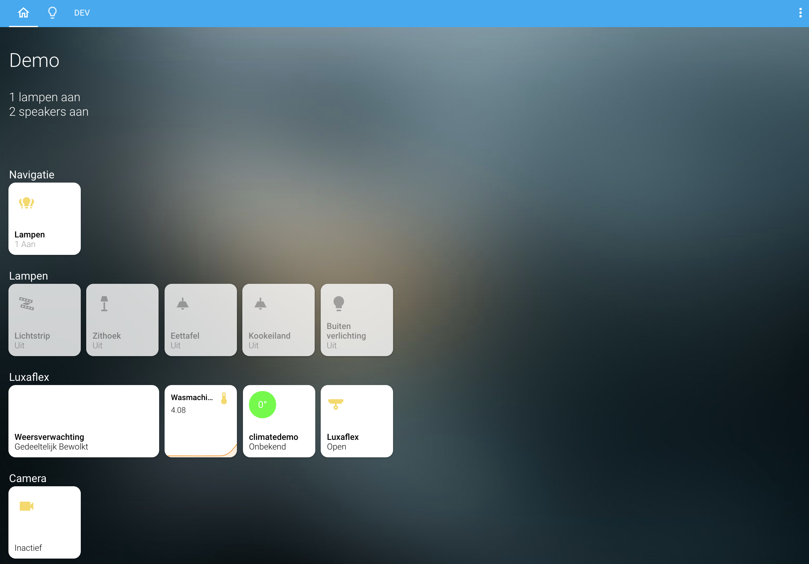
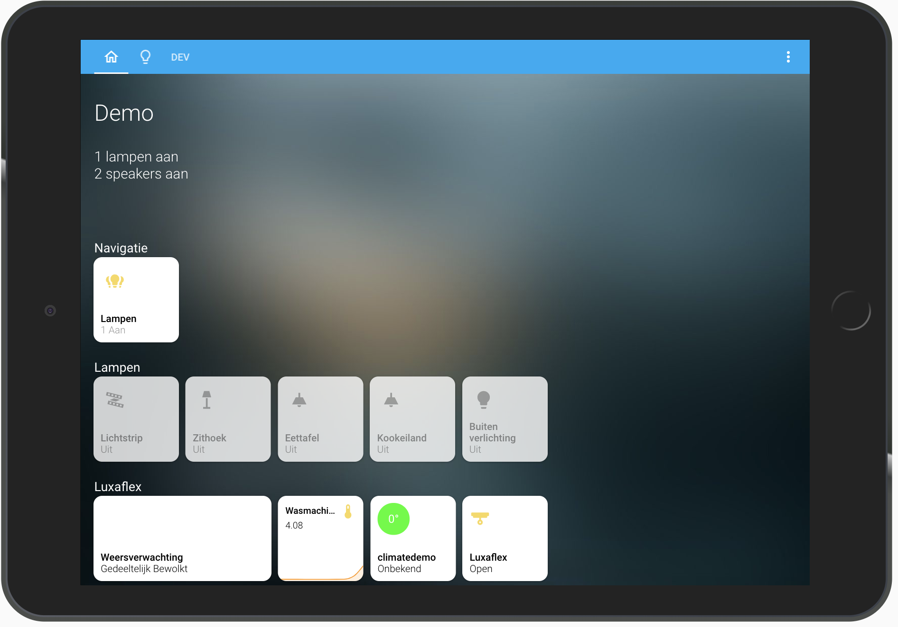
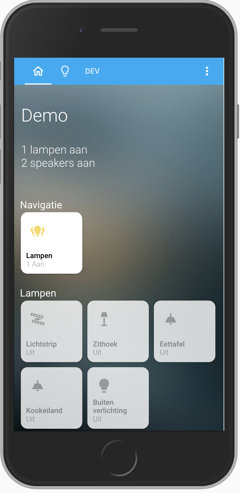
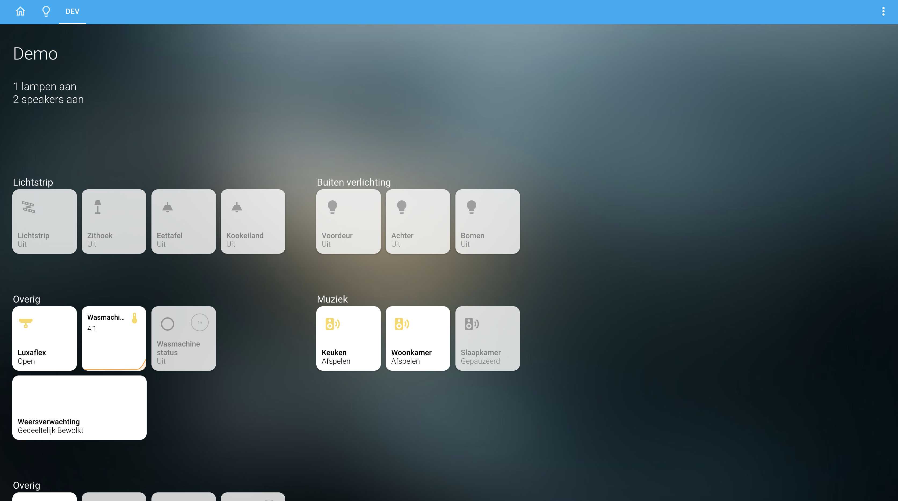
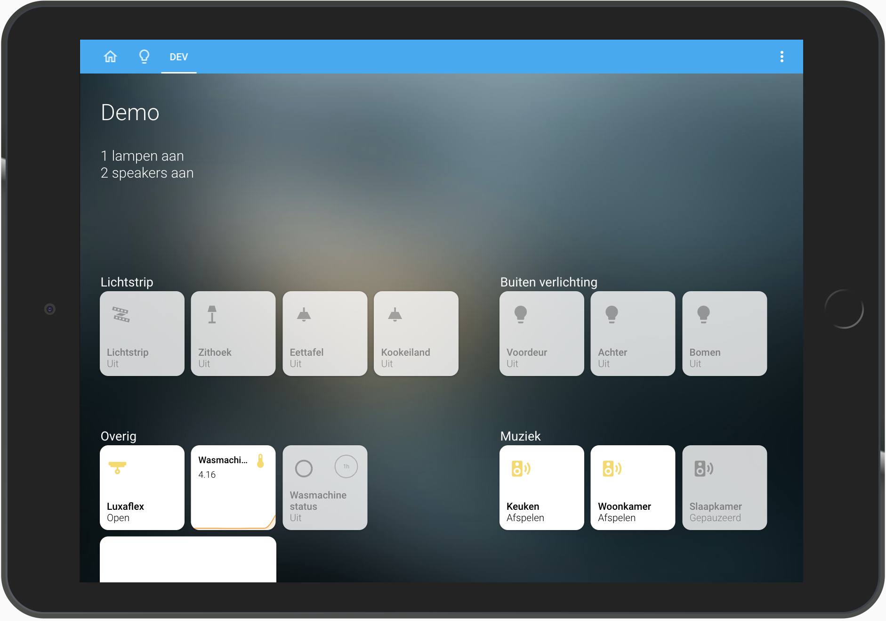
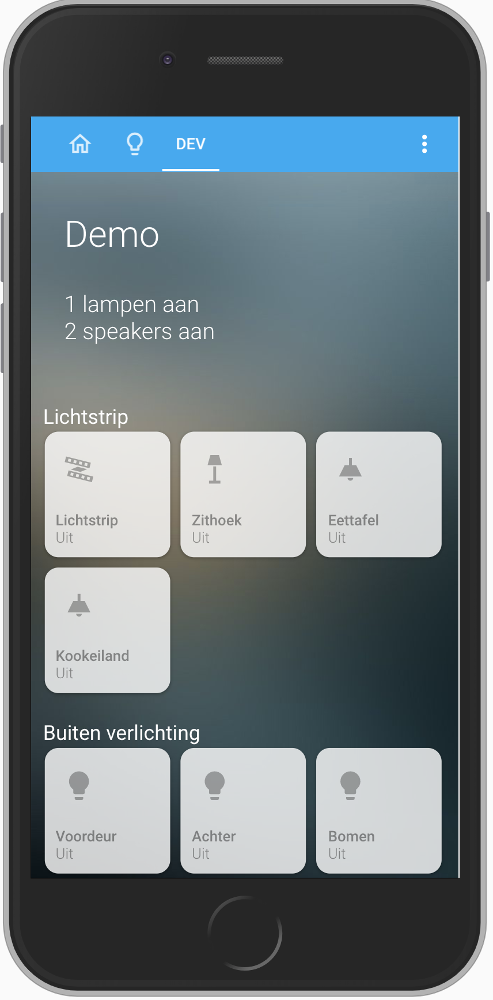

[](https://github.com/custom-components/hacs)

# homekit-card
Homekit style Home Assistant card

This card is best used with `panel: true` so the card fills up the whole page.
The purpose of this card is to fill a page with tiles in homekit style.
You can add entities and define multiple rows with your own title to create your homekit style page.

It is possible that an entity is not standard and is not shown as you expected.
An example of this is weather entity, for this I have therefore added a separate tile to the card so that it is displayed in the correct way. If you have an entity that is not displayed properly, create an issue.

You can also adjust the pop-up that opens when you hold down a tile.
You can have the pop-up open another lovelace card so that you can show other info in the popup, you can also just use the standard.
For lights i have developed a separate card that also has the style of homekit, which you can use well in combination with this card. You can find this card here: https://github.com/DBuit/hass-custom-light-popup-card

Do you have ideas for a custom pop-up create an issue then I can see if I can help with this :)

<a href="https://www.buymeacoffee.com/ZrUK14i" target="_blank"></a>

# TO DO

- Multiple columns (we now got rows with a title)

**Implemented**

- Show graph on tile
- Add HACS support
- Add custom tap actions
- Combine entities
- Add more options for home like notifications, which entities are on for example

You can now render other lovelace cards like mini-graph-card inside a tile [See how to use this](#render-other-lovelace-cards)

## Configuration

### Installation instructions

**HACS installation:**
Go to the hacs store and use the repo url `https://github.com/DBuit/Homekit-panel-card` and add this as a custom repository under settings.

Add the following to your ui-lovelace.yaml:
```yaml
resources:
  url: /community_plugin/homekit-panel-card/homekit-panel-card/.js
  type: module
```

**Manual installation:**
Copy the .js file from the dist directory to your www directory and add the following to your ui-lovelace.yaml file:

```yaml
resources:
  url: /local/homekit-panel-card.js
  type: module
```

### Configure the card in your lovelace-ui.yaml

I will break up the configuration of the card to a few levels.
1. First some global stuff you can configure
2. The rows with tiles that can be configured
3. A specific tile/entity that can be configured


#### 1. Global configuration

First use the custom card and set the panel: true so that it fills up the whole screen.
```
views:
  - title: "Home"
    icon: mdi:home-outline
    path: "home"
    panel: true
    cards:
      - type: "custom:homekit-card"
```

in the card we can define some global configuration below you can find these options:

| Name | Type | Required | Default | Description |
| -------------- | ----------- | ------------ | ------------------------------------------------ | --------------------------------------------------------------------------------------------------------------------------------------------------------------------------------------------------------------------------------------------------------------------------------------------------------------------------------------------- |
| `home` | boolean | optional | false | When true this creates extra space above your tiles where you can show a title and display rules |
| `title` | string | optional | "" | When home is true you can give your page a title |
| `rules` | string | optional | 400px | When home is true you can define rules in template to display stats like how many lights are on or i use it to set a message that i need to put the trash out. |
| `rulesColor` | string | optional | "#FFF" | Default the text is white and this can be overwritten with a new color |
| `tileHoldAnimation` | boolean | optional | false | When true the tile with grow in size when holding :) |
| `title` | string | optional | "" | When home is true you can give your page a title |
| `useBrightness` | boolean | optional | true | When true the lights brightness is used to color the icon |
| `useTemperature` | boolean | optional | false | When true the temperature is used to color the icon |
| `titleColor` | number | optional |  | Titles above a row of tiles is colored by them this can overwrite this color |
| `horizontalScroll` | boolean | optional | false | Default when a tile doesnt fit on the screen it goes to a next row, when you enable this it won't break to a next row but it will be scrollable |
| `enableColumns` | boolean | optional | false | When enabled you can make rows with a title and tiles but also define columns within these rows |
| `statePositionTop` | boolean | optional | false | Default the brightness (for lights) and last_changed (for sensors) is chown in the title next to the current state (on/off) when this is true this state if chown next to the icon in a circle (inspired by: https://community-home-assistant-assets.s3.dualstack.us-west-2.amazonaws.com/optimized/3X/d/c/dcf67fccb5fa3772b2db6d38aeef307d01ba3bc8_2_1380x862.jpeg) |


#### 2. Configure Rows and Tiles


At this point our configuration looks like this for example:
```
views:
  - title: "Home"
    icon: mdi:home-outline
    path: "home"
    panel: true
    cards:
      - type: "custom:homekit-card"
        home: true
        rules: |
           <li>Vandaag groenebak aan de straat</li> 
           <li>Vandaag oudpapier aan de straat</li> 
           <li>Vandaag plastic aan de straat</li> 
           <li>Vandaag grijzebak aan de straat</li> 
           <li>{{states('sensor.current_lights_on')}} lampen aan</li> 
           <li>{{states('sensor.current_media_players_on')}} speakers aan</li> 
        title: "Demo"
        useBrightness: false
        titleColor: "#FFF"
        enableColumns: true
        statePositionTop: true
```

Now we wanna create rows and tiles to display our entities.
In my example i enabled the `enableColumns` but i will first show the configuration if `enableColumns: false`.

We start with `entities:`, every item in the entities is a row with tiles, and every row can have it's own title.
So below `statePositionTop: true` in our example we add the following:

```
        entities:
          - title: Row 1
            entities:
```

As you can se we started with entities inside the entities we defined 1 item with a title rows and an empty list of more `entities`.
These entities are the tiles we wanna display in the row. let's add these tiles!

```
        entities:
          - title: Row 1
            entities:
              - entity: light.zithoek
              - entity: binary_sensor.wasmachine_status
              - entity: media_player.keuken
          - title: Row 2
            entities: 

```

As you can see we can set a list with entities and each one will be one tile. and then we can start a new row by adding a new `- title` with `entities`.

In the above example we only set the `entity:` for a tile that is enough to let it work but we can do more to customize this.

| Name | Type | Required | Default | Description |
| -------------- | ----------- | ------------ | ------------------------------------------------ | --------------------------------------------------------------------------------------------------------------------------------------------------------------------------------------------------------------------------------------------------------------------------------------------------------------------------------------------- |
| `entity` | string | **required** | `light.example` | The only required one is the entity |
| `icon` | string | optional | "" | (for alle types except climate this shows the temperature) |
| `name` | string | optional | You can overwrite the name shown on the tile |
| `offStates` | array | optional | - "paused" | Default the "off" and "unavailable" state will show the tile greyed out but you can set your own list of states that should be considered as off |
| `state` | boolean | optional | false | The tile show extra state info like brightness for lights and last_changed for sensors on the tile you can also set an entity here and the state of this entity is shown on that place |
| `tap_action` | number | optional | See [actions](#action-options) | can be used to customize the action on tap/click (lights and switches have already a tap action) |
| `hold_action` | boolean | optional | See [actions](#action-options) | Set a custom action for hold, default it opens the more-info pop-up |
| `double_tap_action` | boolean | optional | See [actions](#action-options) | Set a custom action for double tap. If no double tap is defined this will default trigger the tap action |
| `offIcon` | boolean | optional | 'mdi:icon' | if you set an offIcon than this icon will be showed when the entity state is equal to an state in the offStates (default off or unavailable). |
| `spin` | boolean | optional | false | If true this will let the icon spin when the entity is on |
| `wider` | boolean | optional | false | If true the tile will be the size of 2 tiles |
| `higher` | boolean | optional | false | If true the tile will be the height of 2 tiles |


##### Custom popup

So now we can create our rows and tiles and customize it the way you want.
But because i developed this card to get a nice homekit style experience i have also developed some pop-up card that can be used in combination with this card.

At this moment i made the following pop-ups: (You got an idea for new ones? let me know!)
- Light pop-up (https://github.com/DBuit/light-popup-card)
- Thermostat/Climate pop-up (https://github.com/DBuit/thermostat-popup-card)

Within this card you can define custom pop-up cards that will be openend when you use the `hold` action/ long press.
You can use my cards or any other card and this will be displayed in a pop-up. 

** Follow installation on the github page of the pop-up card first **

Because you don't want to set this pop-up for every tile you can also set a pop-up for an entire row
so we got this part of the configuration:

```
        entities:
          - title: Row 1
            entities:
              - entity: light.zithoek
              - entity: light.zithoek
              - entity: light.zithoek
          - title: Row 2
            entities: 
```

And in Row 1 we only got lights so it would be nice to have the light pop-up in place.
We can set a `popup` in the row and within the popup we can set a `type` which is a reference to an lovelace card. see the example below:

```
        entities:
          - title: Row 1
            popup:
              type: custom:custom-light-popup-card
            entities:
              - entity: light.zithoek
              - entity: light.zithoek
              - entity: light.zithoek
          - title: Row 2
            entities: 
```

Now when we use the hold/longpress action on our tiles in Row 1 it will not open the default more-info pop-up with it will open a pop-up which shows our custom lovelace card `custom:custom-light-popup-card`. Besides type to set the card you can just set other configuration the card need for example the light popup card could be configured like this:

```
        entities:
          - title: Row 1
            popup:
              type: custom:light-popup-card
              scenesInARow: 2
              brightnessWidth: 130px
              brightnessHeight: 350px
              switchWidth: 110px
              switchHeight: 300px
            entities:
              - entity: light.zithoek
              - entity: light.zithoek
              - entity: light.zithoek
          - title: Row 2
            entities: 
```

It could be in some situations that you wanna use the same popup for every entity but you wanna configur something specific for the popup for some entities. For example the light popup card can also show some actions below the brightness slider to change the color but not all my lights need these actions so i can add `popupExtend:` to the specific entity to extend the popup cards configuration (** it is not to overwrite! **) check out belows example:

```
        entities:
          - title: Row 1
            popup:
              type: custom:light-popup-card
              scenesInARow: 2
              brightnessWidth: 130px
              brightnessHeight: 350px
              switchWidth: 110px
              switchHeight: 300px
            entities:
              - entity: light.zithoek
                popupExtend:
                  actions:
                    - service: scene.turn_on
                      service_data:
                        entity_id: scene.ontspannen
                      color: "#FDCA64"
                      name: ontspannen
                    - service: scene.turn_on
                      service_data:
                        entity_id: scene.helder
                      color: "#FFE7C0"
                      name: helder
                    - service: scene.turn_on
                      service_data:
                        entity_id: scene.concentreren
                      color: "#BBEEF3"
                      name: concentreren
                    - service: scene.turn_on
                      service_data:
                        entity_id: scene.energie
                      color: "#8BCBDD"
                      name: energie
              - entity: light.zithoek
              - entity: light.zithoek
          - title: Row 2
            entities: 
```

Thats all for the popups but we are not yet finished with the posibilities.

##### Custom card as a tile
So we can now place our entities and customize the tiles and set custom popups but sometimes the default tile is not enough!
We want something special but i am the only developer for this card i can't make everyting so we can load als load other lovelace cards inside a tile to be directly displayed on our screen.

A great example of this is the custom card mini-graph-card it can display a graph of sensor data and is awesome to show this directly in a tile so you can do this. How let me show you in the example below:

```
        entities:
          - title: Row 1
            entities:
              - entity: light.zithoek
              - entity: light.zithoek
              - entity: light.zithoek
              - card: custom:mini-graph-card
                cardOptions:
                  entities:
                    - sensor.blink_restafval
                cardStyle: |
                  .header {
                    padding: 0;
                  }
                  .header .icon {
                      color: #f7d959;
                  }
                  .states {
                    padding: 0;
                  }
                  .states .state .state__value {
                    font-size:14px;
                  }
            - title: Row 2
              entities: 
```

In the example you see we **don't** set an entity instead we set `card:` this set the tile to a different type and will load the lovelace card define in this configuration in our example it is the mini-graph-card (of course this card must be installed on your home assistant installation). In probably all cases you wanna use this feature the card won't be displayed really nice in the tile so you can use the `cardStyle` to overwrite the css of the loaded card an change it to look awesome!

Because i really like the mini-graph-card i added the overwritten styles inside my card so when you also wanna use the mini-graph-card you don't need to use the `cardStyle` configuration because i already did that for you!

Of course when you got a custom card you wanna use and you think more people wanna use this share this an i can also add the overwritten styles in the card so the cardStyle is not needed!

##### Fully custom tile
Sometimes we just want a tile to do something but it is not based on an entity we have in our home assistant installtion.
For example i wan't a tile to navigate to my lights page let's see how we can make custom tiles in the example below:

```
        entities:
          - title: Navigation
            entities:
              - custom: lampen
                name: Lampen
                icon: mdi:lightbulb-group
                state: sensor.current_lights_on
                tap_action:
                  action: navigate
                  navigation_path: /lovelace/lampen
                hold_action:
                  action: more-info
                  entity: group.all_lights
          - title: Row of entities
            entities: 
```

In the example you can see we **dont't** set and entity or a card no we use `custom:` and than we use the configuration we now from our default entity options. So we can set the name, icon and the tap_action to make it do something when we click/tap on it. This way we got a nice tile that can do what ever we want.

##### enableColumns

In the beginning of the configuration we got an global configuration named `enableColumns` and when we set this to **true** we can not only make rows with tiles but we can configure columns within these rows.

So the configuration gets a bit more complex because of this so i'm just gonna give an example to show it:
```
views:
  - title: "Example"
    panel: true
    cards:
      - type: "custom:homekit-card"
        rows:
          - row: 1
            columns:
              - column: 1
                tileOnRow: 4
                entities:
                  - title: Lichtstrip
                    entities: 
                      - entity: light.beganegrond  
                      - entity: light.zithoek
                      - entity: light.eettafel
              - column: 2  
                tileOnRow: 3
                entities:
                  - title: Buiten verlichting
                    entities:
                      - entity: light.beganegrond  
                      - entity: light.zithoek
                      - entity: light.eettafel
          - row: 2
            columns:
              - column: 1
                tileOnRow: 4
                entities:
                  - title: Overig
                    entities:
                      - entity: binary_sensor.wasmachine_status
                      - entity: weather.weersverwachting
          - row: 3
            columns:
              - column: 1
                entities:
                  - title: Last row
                    entities:
                      - entity: switch.doorbell_chime_active
                      - entity: switch.doorbell_chime
                      - entity: switch.doorbell_restart
                      - entity: binary_sensor.doorbell_button
                      - entity: light.beganegrond  
                      - entity: light.zithoek
                      - entity: light.eettafel
```

It is a large example but gives an idea how to make multiple rows with its own columns.
Before we started with `entities:` to define our rows now we start with `rows:` and within this we define our `row:`:
```
views:
  - title: "Example"
    panel: true
    cards:
      - type: "custom:homekit-card"
        rows:
          - row: 1
          - row: 2
          - row: 3
```
than within an row we set `columns:` and inside columns we can define our `column:`:
```
views:
  - title: "Example"
    panel: true
    cards:
      - type: "custom:homekit-card"
        rows:
          - row: 1
            columns:
              - column: 1
              - column: 2
          - row: 2
          - row: 3
```
Inside the `column` we got our `entities:` which creates an row of tiles with a tile like before and inside we got another `entities:` with our tiles:
```
views:
  - title: "Example"
    panel: true
    cards:
      - type: "custom:homekit-card"
        rows:
          - row: 1
            columns:
              - column: 1
                entities:
                  - title: Row 1
                    entities: 
                      - entity: light.beganegrond  
                      - entity: light.zithoek
                      - entity: light.eettafel
                - title: Row 2
                    entities: 
                      - entity: light.beganegrond  
                      - entity: light.zithoek
                      - entity: light.eettafel
              - column: 2
          - row: 2
          - row: 3
```
That's all really easy ;)
So one more thing to make this work nice when you go from big screens to smaller screen we need to know how much tiles you want on 1 row so when you define more tiles on one row it will automatically break to a new line. And when an column doesn't fit on the screen it also breaks to a new line. To set this you set `tileOnRow:` in side your `column:` and give this a number for example 3 which says that it will show 3 tiles on a row.

The `tileOnRow:` is **not required** but optional if you do not set this the columns will not break to new lines but the tiles will break which can give a weird look when scaling to smaller sreens but it could also work for you so just play with it!


#### Aaction options

| Name | Type | Default | Supported options | Description |
| ----------------- | ------ | -------- | ---------------------------------------------------------------- | -------------------------------------------------------------------------------------------------------- |
| `action` | string | `toggle` | `more-info`, `toggle`, `call-service`, `none`, `navigate`, `url` | Action to perform |
| `entity` | string | none | Any entity id | **Only valid for `action: more-info` and `action: toggle`** to call `more-info` pop-up for this entity or `toggle` this entity |
| `navigation_path` | string | none | Eg: `/lovelace/0/` | Path to navigate to (e.g. `/lovelace/0/`) when action defined as navigate |
| `url_path` | string | none | Eg: `https://www.google.fr` | URL to open on click when action is `url`. The URL will open in a new tab |
| `service` | string | none | Any service | Service to call (e.g. `media_player.media_play_pause`) when `action` defined as `call-service` |
| `service_data` | object | none | Any service data | Service data to include (e.g. `entity_id: media_player.bedroom`)|


## Example full configuration without columns

Below an example of my configuration without `enableColumns`

```
views:
  - title: "Example"
    icon: mdi:home-outline
    path: "example"
    panel: true
    cards:
      - type: "custom:homekit-card"
        home: true
        rules: |
           <li>Vandaag groenebak aan de straat</li> 
           <li>Vandaag oudpapier aan de straat</li> 
           <li>Vandaag plastic aan de straat</li> 
           <li>Vandaag grijzebak aan de straat</li> 
           <li>{{states('sensor.current_lights_on')}} lampen aan</li> 
           <li>{{states('sensor.current_media_players_on')}} speakers aan</li> 
        title: "Home"
        useBrightness: false
        useTemperature: false
        titleColor: "#FFF"
        entities:
          - title: Navigatie
            entities:
              - custom: lampen
                name: Lampen
                icon: mdi:lightbulb-group
                spin: true
                state: sensor.current_lights_on
                tap_action:
                  action: navigate
                  navigation_path: /lovelace/lampen
                hold_action:
                  action: more-info
                  entity: group.all_lights
                double_tap_action:
                  action: navigate
                  navigation_path: /lovelace/dev
          - title: Lampen
            entities: 
              - entity: light.beganegrond
                name: Lichtstrip
                spin: true
                icon: mdi:led-strip-variant
                popup:
                  type: custom:light-popup-card
                  scenesInARow: 2
                  brightnessWidth: 130px
                  brightnessHeight: 350px
                  switchWidth: 110px
                  switchHeight: 300px
                  actions:
                    - service: scene.turn_on
                      service_data:
                        entity_id: scene.ontspannen
                      color: "#FDCA64"
                      name: ontspannen
                    - service: scene.turn_on
                      service_data:
                        entity_id: scene.helder
                      color: "#FFE7C0"
                      name: helder
                    - service: scene.turn_on
                      service_data:
                        entity_id: scene.concentreren
                      color: "#BBEEF3"
                      name: concentreren
                    - service: scene.turn_on
                      service_data:
                        entity_id: scene.energie
                      color: "#8BCBDD"
                      name: energie
                    - service: homeassistant.toggle
                      service_data:
                        entity_id: light.voordeurlicht
                      name: voordeur
                      icon: mdi:lightbulb
              - entity: light.zithoek
                name: Zithoek
                icon: mdi:floor-lamp
                popup:
                  type: custom:light-popup-card
                  scenesInARow: 2
                  brightnessWidth: 130px
                  brightnessHeight: 350px
                  switchWidth: 110px
                  switchHeight: 300px
              - entity: light.eettafel
                name: Eettafel
                icon: mdi:ceiling-light
                popup:
                  type: custom:light-popup-card
                  scenesInARow: 2
                  brightnessWidth: 130px
                  brightnessHeight: 350px
                  switchWidth: 110px
                  switchHeight: 300px
              - entity: light.kookeiland
                name: Kookeiland
                icon: mdi:ceiling-light
                popup:
                  type: custom:light-popup-card
                  scenesInARow: 2
                  brightnessWidth: 130px
                  brightnessHeight: 350px
                  switchWidth: 110px
                  switchHeight: 300px
              - entity: group.outdoor_lights
                name: Buiten verlichting
                tap_action:
                  action: toggle
                  entity: group.outdoor_lights
          - title: Luxaflex
            entities:
              - entity: weather.weersverwachting
              - card: custom:mini-graph-card
                noPadding: true
                cardOptions:
                  entities:
                    - sensor.wasmachine_energieverbruik
              - entity: climate.climatedemo
                popup:
                  type: custom:thermostat-popup-card
              - card: custom:blinds-tile-card
                tap_action:
                  action: more-info
                  entity: input_number.blindone
                cardOptions:
                  name: Luxaflex
                  entities:
                    - entity: input_number.blindone
                      positions: 
                        - 60
                        - 0
                        - -45
                    - entity: input_number.blindtwo
                      positions: 
                        - 75
                        - 0
                        - -50
                    - entity: input_number.blindthree
                      positions: 
                        - -65
                        - 0
                        - 50
          - title: Camera
            entities:
              - entity: camera.telefoon_daan
                spin: true
```

## Example full configuration with columns

Below an example of my configuration with `enableColumns: true`

```
views:
  - title: "Example"
    path: "example"
    panel: true
    cards:
      - type: "custom:homekit-card"
        home: true
        rules: |
           <li>Vandaag groenebak aan de straat</li> 
           <li>Vandaag oudpapier aan de straat</li> 
           <li>Vandaag plastic aan de straat</li> 
           <li>Vandaag grijzebak aan de straat</li> 
           <li>{{states('sensor.current_lights_on')}} lampen aan</li> 
           <li>{{states('sensor.current_media_players_on')}} speakers aan</li> 
        title: "Home"
        useBrightness: false
        useTemperature: false
        titleColor: "#FFF"
        enableColumns: true
        statePositionTop: true
        rows:
          - row: 1
            columns:
              - column: 1
                tileOnRow: 4
                entities:
                  - title: Lichtstrip
                    popup:
                      type: custom:light-popup-card
                      scenesInARow: 2
                      brightnessWidth: 130px
                      brightnessHeight: 350px
                      switchWidth: 110px
                      switchHeight: 300px
                    entities: 
                      - entity: light.beganegrond
                        name: Lichtstrip
                        icon: mdi:led-strip-variant
                        popupExtend:
                          actions:
                            - service: scene.turn_on
                              service_data:
                                entity_id: scene.ontspannen
                              color: "#FDCA64"
                              name: ontspannen
                            - service: scene.turn_on
                              service_data:
                                entity_id: scene.helder
                              color: "#FFE7C0"
                              name: helder
                            - service: scene.turn_on
                              service_data:
                                entity_id: scene.concentreren
                              color: "#BBEEF3"
                              name: concentreren
                            - service: scene.turn_on
                              service_data:
                                entity_id: scene.energie
                              color: "#8BCBDD"
                              name: energie
                      - entity: light.zithoek
                        name: Zithoek
                        icon: mdi:floor-lamp
                      - entity: light.eettafel
                        name: Eettafel
                        icon: mdi:ceiling-light
                      - entity: light.kookeiland
                        name: Kookeiland
                        icon: mdi:ceiling-light
              - column: 2  
                tileOnRow: 3
                entities:
                  - title: Buiten verlichting
                    entities:
                      - entity: light.voordeurlicht
                        name: Voordeur
                      - entity: light.buitenverlichting_achter
                        name: Achter
                      - entity: light.buitenverlichting_bomen
                        spin: true
                        name: Bomen
          - row: 2
            columns:
              - column: 1
                tileOnRow: 4
                entities:
                  - title: "Overig"
                    entities:
                      - card: custom:blinds-tile-card
                        tap_action:
                          action: more-info
                          entity: input_number.blindone
                        cardOptions:
                          name: Luxaflex
                          entities:
                            - entity: input_number.blindone
                              positions: 
                                - 60
                                - 0
                                - -45
                            - entity: input_number.blindtwo
                              positions: 
                                - 75
                                - 0
                                - -50
                            - entity: input_number.blindthree
                              positions: 
                                - -65
                                - 0
                                - 50
                      - card: custom:mini-graph-card
                        noPadding: true
                        cardOptions:
                          entities:
                            - sensor.wasmachine_energieverbruik
                      - entity: binary_sensor.wasmachine_status
                      - entity: weather.weersverwachting
              - column: 2
                tileOnRow: 3
                entities:
                  - title: Muziek
                    entities:
                      - entity: media_player.keuken
                        icon: mdi:speaker-wireless
                        offIcon: 'mdi:garage'
                        offStates:
                          - "off"
                          - "unavailable"
                          - "paused"
                      - entity: media_player.woonkamer
                        icon: mdi:speaker-wireless
                        offStates:
                          - "off"
                          - "unavailable"
                          - "paused"
                      - entity: media_player.slaapkamer
                        icon: mdi:speaker-wireless
                        offStates:
                          - "off"
                          - "unavailable"
                          - "paused"
          - row: 3
            columns:
              - column: 3
                entities:
                  - title: Overig
                    entities:
                      - entity: switch.doorbell_chime_active
                        spin: true
                      - entity: switch.doorbell_chime
                      - entity: switch.doorbell_restart
                      - entity: binary_sensor.doorbell_button
```

## Screenshots

### Screenshots without columns





### Screenshots with columns



