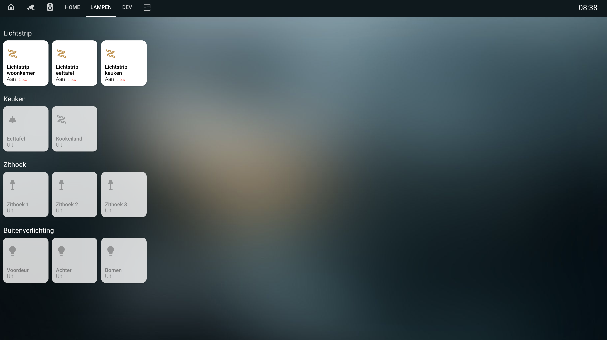

# homekit-card
Homekit style Home Assistant card

This card is best used with `panel: true` so the card fills up the whole page.
The purpose of this card is to fill a page with tiles in homekit style.
You can add entities and define multiple rows with your own title to create your homekit style page.

It is possible that an entity is not standard and is not shown as you expected.
An example of this is weather entity, for this I have therefore added a separate tile to the card so that it is displayed in the correct way. If you have an entity that is not displayed properly, create an issue.

You can also adjust the pop-up that opens when you hold down a tile.
You can have the pop-up open another lovelace card so that you can show other info in the popup, you can also just use the standard.
For lights i have developed a separate card that also has the style of homekit, which you can use well in combination with this card. You can find this card here: https://github.com/DBuit/hass-custom-light-popup-card

Do you have ideas for a custom pop-up create an issue then I can see if I can help with this :)

# TO DO

- Add HACS support
- Combine entities
- Multiple columns (we now got rows with a title)
- Add more options for home like notifications, which entities are on, calendar events
- Add scenes till/options

**Implemented**

- Show graph on tile

You can now render other lovelace cards like mini-graph-card inside a tile [See how to use this](#render-other-lovelace-cards)

# Config options

### Installation instructions

Add the homekit-panel-card.js file in the dist folder to your installation and add the following to your ui-lovelace.yaml.
 
```yaml
resources:
  url: /local/homekit-panel-card.js
  type: module
```

### Add the card
```
- type: "custom:homekit-card"
  home: true // Optional in combination with the title
  title: "My House" // If you set home to true you get more space above your tiles and get set a title. in future more information will be shown like what entities are on and calendar events.
  useBrightness: false // use brightness of a light for icon color on tile, default true
  useTemperature: false // use temperature of a light for icon color on tile, default: false
  breakOnMobile: true // On mobile show max 3 tiles on a row, default false -> horizontal scrollable row of tiles
  entities:
```

### Define multiple rows of tiles under entities
```
- title: Sensors
  entities:
    - entity: sensor.sensor
      name: "Optional name"
    - entity: binary_sensor.sensor
      name: "Optional name"
    - entity: light.light
- title: Lights
  entities:
    - entity: light.light2
      name: "Optional name light"
    - entity: light.light
```

### Extra entity config

You can configure some configuration for an specific entity. These are all optional.
offStates are default "off" and "unavailable".

```
- title: Sensors
  entities:
    - entity: media_player.sonos
      icon: mdi:speaker-wireless
      name: "Sonos mediaplayer"
      offStates:
        - "off"
        - "unavailable"
        - "paused"
```

### Render other lovelace cards
Render a other lovelace card (custom or default) inside the tile to get more functionality.
You can show an iframe or use the mini graph card


```
Instead of setting the entity you set the card with the lovelace card you wanna render.
Second you set the cardOptions, this is the configuration you would normally use to configure the card (so this will probably contain the entity_id atleast)
Third you can define styles which will overwrite the normal styles of the card so it fits better in the homekit style.

These other cards have build in overwritten styles so you can juse use them:
- mini-graph-card


Example configuration of 2 card:

- title: other cards
  entities:
    - card: custom:mini-graph-card
      cardOptions:
        entities:
          - sensor.blink_restafval
      cardStyle: |
        :host {
          height: 100%;
        }
        ha-card {
          background: transparent;
          color: #000;
          padding: 0!important;
          box-shadow: none;
        }
        .header {
          padding: 0;
        }
        .header .icon {
            color: #f7d959;
        }
        .states {
          padding: 0;
        }
        .states .state .state__value {
          font-size:14px;
        }
    - card: iframe
      noPadding: true
      cardOptions:
        aspect_ratio: 100%
        url: https://gadgets.buienradar.nl/gadget/zoommap/?lat=51.28583&lng=5.74861&overname=2&zoom=11&naam=Nederweert&size=3b&voor=1
```

### Set custom pop-up card for an entire row
```
- title: Sensors
  popup:
    type: custom:custom-light-popup-card
    # IF THE CARD AS OTHER CONFIG U CAN JUST ADD THEM UNDER THE TYPE #
  entities:
    - entity: sensor.sensor
      name: "Optional name"
    - entity: binary_sensor.sensor
      name: "Optional name"
    - entity: light.light
- title: Lights
  entities:
    - entity: light.light2
      name: "Optional name light"
    - entity: light.light
```

If you want every card to have the same pop-up but some config of the pop-up card is not for every entity
you can set some extended config on the specific entity

```
- title: Sensors
  popup:
    type: custom:custom-light-popup-card
    # IF THE CARD AS OTHER CONFIG U CAN JUST ADD THEM UNDER THE TYPE #
  entities:
    - entity: sensor.sensor
      name: "Optional name"
      popupExtend: # As example the light popup card can define scenes but these are entity specific #
        scenes:
          - scene: scene.ontspannen
            color: "#FDCA64"
            name: ontspannen
    - entity: binary_sensor.sensor
      name: "Optional name"
    - entity: light.light
- title: Lights
  entities:
    - entity: light.light2
      name: "Optional name light"
    - entity: light.light
```

If you don't want to use the same pop-up card for every entity in a row you can also set the pop-up on the entity

```
- title: Sensors
  entities:
    - entity: sensor.sensor
      name: "Optional name"
    - entity: binary_sensor.sensor
      name: "Optional name"
    - entity: light.light
- title: Lights
  entities:
    - entity: light.light2
      name: "Optional name light"
    - entity: light.light
      popup:
        type: custom:custom-light-popup-card
        switchWidth: 110px
        switchHeight: 300px
```

# Example full configuration of the card with use of the custom light pop-up
```
- title: "Lights"
    panel: true
    cards:
      - type: "custom:homekit-card"
        entities:
          - title: Lights
            popup:
              type: custom:custom-light-popup-card
              scenesInARow: 2
              brightnessWidth: 130px
              brightnessHeight: 350px
              switchWidth: 110px
              switchHeight: 300px
            entities: 
              - entity: light.light1
                popupExtend:
                  scenes:
                    - scene: scene.ontspannen
                      color: "#FDCA64"
                      name: ontspannen
                    - scene: scene.helder
                      color: "#FFE7C0"
                      name: helder
                    - scene: scene.concentreren
                      color: "#BBEEF3"
                      name: concentreren
                    - scene: scene.energie
                      color: "#8BCBDD"
                      name: energie
              - entity: light.light2
              - entity: light.light3
          - title: Outside lights
            entities:
              - entity: light.light4
                name: "Frontdoor"
                popup:
                  type: custom:custom-light-popup-card
                  switchWidth: 110px
                  switchHeight: 300px
          - title: Sensors
            entities:
              - entity: sensor.sensor1
                name: "Battery"
              - entity: binary_sensor.sensor2
                name: "Frontdoor"
              - card: custom:mini-graph-card
                cardOptions:
                  entities:
                    - sensor.blink_restafval
                cardStyle: |
                  :host {
                    height: 100%;
                  }
                  ha-card {
                    background: transparent;
                    color: #000;
                    padding: 0!important;
                    box-shadow: none;
                  }
                  .header {
                    padding: 0;
                  }
                  .header .icon {
                      color: #f7d959;
                  }
                  .states {
                    padding: 0;
                  }
                  .states .state .state__value {
                    font-size:14px;
                  }
              - card: iframe
                noPadding: true
                cardOptions:
                  aspect_ratio: 100%
                  url: https://gadgets.buienradar.nl/gadget/zoommap/?lat=51.28583&lng=5.74861&overname=2&zoom=11&naam=Nederweert&size=3b&voor=1
```
## Screenshots





